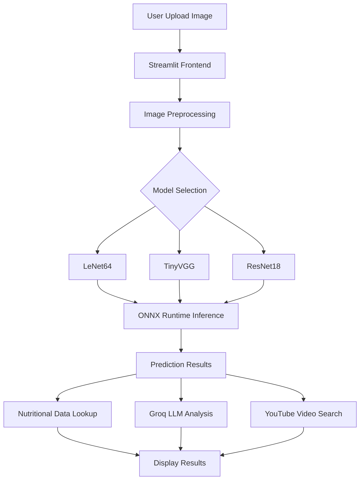

# FoodNet: Food Recognition Project Report

## Executive Summary

**FoodNet** is a deep learning-powered web application that classifies food images into three categories: **Pizza**, **Steak**, and **Sushi**. Built with PyTorch and deployed via Streamlit, this project demonstrates end-to-end machine learning implementation from model training to production deployment.

**Key Features:**
- Multi-model architecture support (LeNet64, TinyVGG, ResNet18)
- Real-time image classification with confidence scores
- Nutritional information lookup
- AI-generated food descriptions using Groq LLM
- YouTube cooking video recommendations
- Interactive web interface with visualizations

---

## Table of Contents

1. [Project Architecture](#project-architecture)
2. [Technical Stack](#technical-stack)
3. [Model Architectures](#model-architectures)
4. [Project Structure](#project-structure)
5. [Core Components](#core-components)
6. [Features](#features)
7. [Data Pipeline](#data-pipeline)
8. [Deployment](#deployment)
9. [Future Enhancements](#future-enhancements)

---

## Project Architecture



---

## Technical Stack

### Core Technologies

| Component | Technology | Version/Details |
|-----------|-----------|----------------|
| **Deep Learning** | PyTorch | Neural network training & architecture |
| **Inference** | ONNX Runtime | Optimized model execution |
| **Web Framework** | Streamlit | Interactive UI |
| **LLM Integration** | Groq API | Food descriptions & recipes |
| **Data Analysis** | Pandas, NumPy | Data processing |
| **Visualization** | Plotly Express | Interactive charts |
| **Video Search** | YouTube Search | Recipe video recommendations |

### Dependencies

```python
# Key Libraries
- streamlit
- torch
- onnxruntime
- Pillow (PIL)
- pandas
- numpy
- plotly
- groq
- youtube-search
- python-dotenv
```

---

## Model Architectures

### 1. LeNet64

**Architecture:** Classic LeNet adapted for 64×64 RGB images

**Specifications:**
- **Input:** 64×64×3 (RGB images)
- **Output:** 3 classes (Pizza, Steak, Sushi)
- **Layers:**
  - Conv2D (6 filters, 5×5 kernel) + BatchNorm + ReLU
  - AvgPool (2×2)
  - Conv2D (16 filters, 5×5 kernel) + BatchNorm + ReLU
  - AvgPool (2×2)
  - Fully Connected (2704 → 120 → 84 → 3)

**Key Features:**
- Kaiming initialization for conv layers
- Xavier initialization for fully connected layers
- Batch normalization for training stability

```python
class Model(nn.Module):
    def __init__(self, in_channels=3, num_classes=3, pool_type="avg"):
        super().__init__()
        self.conv1 = nn.Conv2d(in_channels, 6, kernel_size=5)
        self.bn1 = nn.BatchNorm2d(6)
        self.conv2 = nn.Conv2d(6, 16, kernel_size=5)
        self.bn2 = nn.BatchNorm2d(16)
        self.pool = nn.AvgPool2d(2, 2)
        self.fc1 = nn.Linear(16 * 13 * 13, 120)
        self.fc2 = nn.Linear(120, 84)
        self.fc3 = nn.Linear(84, num_classes)
```

---

### 2. TinyVGG

**Architecture:** Lightweight VGG-inspired convolutional network

**Specifications:**
- **Input:** 224×224×3 (RGB images)
- **Output:** 3 classes
- **Blocks:**
  - **Block 1:** 2× Conv2D + BatchNorm + ReLU + MaxPool + Dropout
  - **Block 2:** 2× Conv2D + BatchNorm + ReLU + MaxPool + Dropout
  - **Classifier:** Flatten + Linear

**Key Features:**
- Dropout (25%) for regularization
- Batch normalization
- Padding preservation (same convolutions)

---

### 3. ResNet18

**Architecture:** Pre-trained ResNet18 (transfer learning)

**Specifications:**
- **Input:** 224×224×3
- **Output:** 3 classes (fine-tuned)
- **Parameters:** ~11M
- **Training:** Transfer learning from ImageNet

---

## Project Structure

```
Food_Recognition_Project/
├── app.py                      # Main Streamlit application
├── config.py                   # Configuration & settings
├── __init__.py                 # Package initializer
│
├── architecture/               # Model definitions
│   ├── lenet64.py             # LeNet64 architecture
│   └── tinyvgg.py             # TinyVGG architectures
│
├── models/                     # Trained models
│   ├── onnx/                  # ONNX format models
│   │   ├── lenet64.onnx
│   │   ├── tinyvgg.onnx
│   │   └── resnet18.onnx
│   └── torch/                 # PyTorch format models
│
├── utils/                      # Utility modules
│   ├── preprocessing.py       # Image preprocessing
│   ├── inference.py           # Model inference logic
│   ├── nutrients.py           # Nutritional data lookup
│   ├── groq_analysis.py       # LLM-based food analysis
│   └── youtube_service.py     # Video search integration
│
├── data/                       # Data files
│   └── nutrients.csv          # Nutritional information (101 foods)
│
└── notebooks/                  # Jupyter notebooks
    ├── 001_eda.ipynb          # Exploratory Data Analysis
    ├── 002_lenet.ipynb        # LeNet training
    ├── 004_tinyvgg.ipynb      # TinyVGG training
    ├── 005_resnet.ipynb       # ResNet training
    └── 006-onnx_conversion.ipynb  # Model conversion
```

---

## Core Components

### 1. Configuration Management: config.py

Central configuration class managing paths and settings:

```python
class Config:
    APP_NAME = "FoodVision: Food Classification using PyTorch and Groq"
    GROQ_API_KEY = os.getenv("PUBLIC_GROQ_API_KEY")
    
    ONNX_PATH = {
        "lenet64": "models/onnx/lenet64.onnx",
        "tinyvgg": "models/onnx/tinyvgg.onnx",
        "resnet18": "models/onnx/resnet18.onnx"
    }
    
    CLASS_NAMES = ["pizza", "steak", "sushi"]
    DEVICE = "cuda" if torch.cuda.is_available() else "cpu"
```

---

### 2. Image Preprocessing: utils/preprocessing.py

Handles image normalization and transformation:

**Process:**
1. Resize image (64×64 for LeNet, 224×224 for others)
2. Convert to NumPy array
3. Normalize pixel values to [0,1]
4. Apply ImageNet normalization (mean/std)
5. Transpose to channel-first format (C,H,W)
6. Add batch dimension

```python
def preprocess(image: Image.Image, model_name: str = "resnet18") -> np.ndarray:
    # Resize based on model
    size = (64, 64) if model_name == "lenet64" else (224, 224)
    image = image.resize(size)
    
    # Normalize with ImageNet stats
    img_array = np.array(image).astype(np.float32) / 255.0
    mean = np.array([0.485, 0.456, 0.406])
    std = np.array([0.229, 0.224, 0.225])
    img_array = (img_array - mean) / std
    
    # Format for PyTorch (B, C, H, W)
    img_array = img_array.transpose(2, 0, 1)
    return np.expand_dims(img_array, axis=0)
```

---

### 3. Model Inference: utils/inference.py

Executes ONNX model predictions:

**Features:**
- Numerically stable softmax implementation
- ONNX Runtime with CUDA support
- Returns class index and probability distribution

```python
def run_inference(session: ort.InferenceSession, input_array: np.ndarray):
    input_name = session.get_inputs()[0].name
    outputs = session.run(None, {input_name: input_array})
    
    logits = outputs[0]
    probs = softmax(logits)
    pred_index = int(np.argmax(probs, axis=1)[0])
    
    return pred_index, probs[0]
```

---

### 4. Nutritional Data Lookup: utils/nutrients.py

Searches nutritional database for food items:

**Data Fields (per 100g):**
- Calories
- Protein
- Carbohydrates
- Fat
- Fiber
- Sugar

**Implementation:**
```python
def filter_csv_by_label(label_value):
    df = pd.read_csv(settings.NUTRIENTS_PATH)
    return df[df['label'].str.lower() == label_value.lower()]
```

---

### 5. LLM-Powered Food Analysis: utils/groq_analysis.py

Generates AI-powered food descriptions using Groq's LLaMA 3.3 70B:

**Capabilities:**
- Food descriptions
- Recipe details
- Cooking tips

```python
def get_food_description(food_name: str, model="llama-3.3-70b-versatile"):
    client = Groq(api_key=settings.GROQ_API_KEY)
    response = client.chat.completions.create(
        model=model,
        messages=[{
            "role": "user", 
            "content": f"Give a small description, recipe details and some cooking tips for {food_name}?"
        }]
    )
    return response.choices[0].message.content
```

---

### 6. YouTube Video Integration: utils/youtube_service.py

Fetches cooking tutorials from YouTube:

**Features:**
- Searches for detailed cooking videos
- Filters by minimum duration (10+ minutes)
- Randomly selects from valid results

```python
def get_cooking_videos(food_name: str, min_minutes: int = 10):
    query = f"how to cook {food_name} in detail"
    results = YoutubeSearch(query, max_results=10).to_dict()
    
    # Filter by duration
    valid_videos = [
        video for video in results
        if parse_duration_to_minutes(video["duration"]) >= min_minutes
    ]
    
    video = random.choice(valid_videos)
    return {
        "title": video["title"],
        "url": f"https://www.youtube.com/watch?v={video['id']}",
        "thumbnail": video["thumbnails"][0],
        "duration": video["duration"]
    }
```

---

## Features

### 1. Multi-Model Support

Users can select from three different architectures:
- **LeNet64:** Lightweight, fast inference
- **TinyVGG:** Balanced accuracy/speed
- **ResNet18:** Highest accuracy (transfer learning)

### 2. Real-Time Classification

- Upload images in JPG, JPEG, or PNG formats
- Instant predictions with confidence scores
- Interactive probability visualization (pie chart)

### 3. Nutritional Information

Displays comprehensive nutritional data per 100g:
- **Pizza:** 266 calories, 11g protein, 33g carbs, 10g fat
- **Steak:** 271 calories, 25g protein, 0g carbs, 18g fat
- **Sushi:** 200 calories, 8g protein, 28g carbs, 5g fat

### 4. AI-Generated Insights

Uses Groq's LLaMA 3.3 to provide:
- Food descriptions
- Recipe instructions
- Cooking tips and techniques

### 5. Video Recommendations

Automatically finds relevant cooking tutorials on YouTube with:
- Video title and duration
- Direct playback in app
- Minimum 10-minute detailed tutorials

---

## Data Pipeline

### Training Data
- **Dataset:** Food-101 subset (Pizza, Steak, Sushi)
- **Notebooks:** 5 Jupyter notebooks documenting the ML pipeline

### Pipeline Stages

1. **EDA**: 001_eda.ipynb
   - Data exploration
   - Class distribution analysis
   - Image statistics

2. **Model Training**
   - 002_lenet.ipynb: LeNet64 experiments
   - 004_tinyvgg.ipynb: TinyVGG variants
   - 005_resnet.ipynb: Transfer learning

3. **Model Conversion** (006-onnx_conversion.ipynb)
   - PyTorch → ONNX export
   - Model optimization
   - Validation

---

## Deployment

### Application Stack

**Framework:** Streamlit  
**Inference Engine:** ONNX Runtime  
**Execution Providers:** CUDA (GPU) / CPU fallback

### Running the Application

```bash
# Install dependencies
pip install -r requirements.txt

# Set environment variables
echo "PUBLIC_GROQ_API_KEY=your_api_key" > .env

# Launch application
streamlit run app.py
```

### Session State Management

The app uses Streamlit's session state to persist:
- Prediction results
- Confidence scores
- Probability distributions
- Video data
- UI state (nutrient display toggle)

```python
# Initialize session state
if "prediction" not in st.session_state:
    st.session_state.prediction = None
if "probabilities" not in st.session_state:
    st.session_state.probabilities = None
```

---

## User Interface

### Layout Structure

```
┌─────────────────────────────────────────────┐
│         FoodNet 🍕🥩🍣                      │
├─────────────────────────────────────────────┤
│ Sidebar:           │  Main Content:         │
│  - Model Selection │  ┌──────────────────┐  │
│  - Image Upload    │  │ Uploaded Image   │  │
│  - Analyze Button  │  └──────────────────┘  │
│                    │  ┌──────────────────┐  │
│                    │  │ Prediction       │  │
│                    │  │ Confidence: 95%  │  │
│                    │  └──────────────────┘  │
├─────────────────────────────────────────────┤
│  Class Probabilities (Pie Chart)            │
├─────────────────────────────────────────────┤
│  Nutritional Information Table              │
├─────────────────────────────────────────────┤
│  AI-Generated Description & Tips            │
├─────────────────────────────────────────────┤
│  Cooking Video (YouTube Embed)              │
└─────────────────────────────────────────────┘
```

### Interactive Elements

1. **Model Selection Dropdown:** Choose architecture
2. **File Uploader:** Drag-and-drop image upload
3. **Analyze Button:** Trigger inference
4. **Show Nutritional Information Button:** Toggle nutrition panel
5. **Plotly Pie Chart:** Interactive class probabilities

---

## Future Enhancements

### Model Improvements
- [ ] Expand to 101 food classes (full Food-101 dataset)
- [ ] Implement ensemble predictions
- [ ] Add model explainability (Grad-CAM)
- [ ] Support for multi-food detection

### Feature Additions
- [ ] User authentication and history tracking
- [ ] Calorie calculator based on portion size
- [ ] Allergen warnings and dietary restrictions
- [ ] Recipe recommendations based on ingredients
- [ ] Mobile app deployment (iOS/Android)

### Technical Optimizations
- [ ] Model quantization for faster inference
- [ ] Batch processing for multiple images
- [ ] Cloud deployment (AWS/GCP/Azure)
- [ ] API endpoint for external integrations
- [ ] Docker containerization

### Data Enhancements
- [ ] Expand nutritional database
- [ ] Add regional cuisine variations
- [ ] User-contributed food images
- [ ] Data augmentation pipeline

### Difficulties Faced

- [ ] Model training and optimization: Model training was limited to 3 classes due to computational constraints. Even in colab it was taking too much time to train the model.
- [ ] Deployment and scaling: Deployment was successful but scaling was not possible due to the limitations of the hardware.
- [ ] Model selection and validation: I had planned to implement more models but due to time and computational constraints I was not able to do so.

---

## Key Technical Achievements

> [!IMPORTANT]
> **Production-Ready Features**
> - ✅ Multi-model architecture support with seamless switching
> - ✅ ONNX optimization for cross-platform deployment
> - ✅ GPU acceleration with automatic CPU fallback
> - ✅ Comprehensive error handling and logging
> - ✅ Modular codebase with clear separation of concerns

> [!TIP]
> **Performance Optimization**
> - ImageNet normalization for transfer learning compatibility
> - Batch normalization for training stability
> - Dropout regularization to prevent overfitting
> - Efficient session state management in Streamlit

---

## Configuration Requirements

### Environment Variables

```bash
PUBLIC_GROQ_API_KEY=<your_groq_api_key>
```

---

## Conclusion

**FoodNet** demonstrates a complete end-to-end deep learning application combining:
- **Computer Vision:** Multi-architecture food classification
- **Natural Language Processing:** AI-generated food insights
- **Data Integration:** Nutritional database and video recommendations
- **Web Deployment:** Interactive Streamlit interface

The project showcases modern AI engineering practices including model optimization (ONNX), transfer learning, and API integrations, making it a robust foundation for food recognition applications.

---

## Project Metadata

| Property | Value |
|----------|-------|
| **Project Name** | FoodNet |
| **Version** | 1.0 |
| **Author** | Reality AI Team |
| **Framework** | PyTorch + Streamlit |
| **Models** | LeNet64, TinyVGG, ResNet18 |
| **Classes** | Pizza, Steak, Sushi |
| **Inference Engine** | ONNX Runtime |
| **LLM Provider** | Groq (LLaMA 3.3 70B) |
| **Date** | December 2025 |

---
